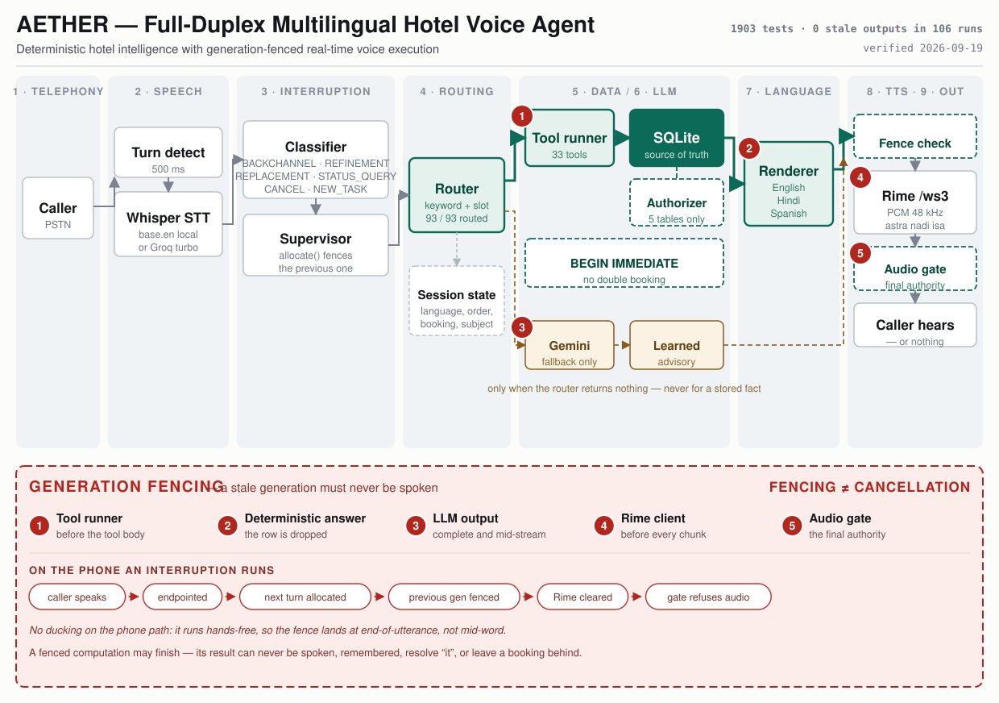

<div align="center">

# AETHER

### A hotel's telephone line where interrupting is safe.

**English  ·  हिन्दी  ·  Español**


</div>

> ### A stale result must never become spoken output.
>
> The one rule the whole system is built around — and the thing that is hardest to get right on a
> telephone, because audio cannot be un-spoken.

AETHER answers a hotel's phone as its duty manager. Callers ask about the menu, the rooms and the
hotel's policies in ordinary speech, and can book a room, book a table or order food. They can also
do what people on the phone always do: interrupt, change their mind halfway through an answer, or
say *stop*. AETHER keeps up — and never says something that has stopped being true.

<div align="center">

<a href="docs/architecture.svg"></a>

<sub><b><a href="docs/architecture.svg">Click to enlarge</a>.</b> The deterministic path is drawn
heavy and the LLM fallback light because that is their real proportion. The dashed red overlay is
the differentiator.</sub>

</div>

| Claim | Why you should believe it |
|:--|:--|
| **0** stale outputs spoken, 106 recorded runs | `ResultLeaked` has never fired in [`traces/`](traces/) · [scenario A](tests/test_acceptance.py) asserts the fence *and* asserts the event absent |
| **5** independent fence checkpoints | Five distinct `ResultDiscarded` reasons in source — [`aether/tools/__init__.py`](aether/tools/__init__.py), [`aether/spike.py`](aether/spike.py) ×3, [`aether/audio/player.py`](aether/audio/player.py) · counted by [`scripts/metrics.py`](scripts/metrics.py) |
| **33** hotel tools, **0.90 ms** median answer | [`aether/hotel/tools.py`](aether/hotel/tools.py) · timed by `python scripts/measure_understanding.py` |
| **93 / 93** multilingual routing | [`tests/test_understanding.py`](tests/test_understanding.py) — which also enforces that all three languages are tested *equally* |
| Hotel facts never touch the LLM | `llm_ms = 0` on 11 of 16 turns in [`evidence/demo-run.jsonl`](evidence/demo-run.jsonl) |
| Nothing can reprice the menu | SQLite authorizer in [`aether/hotel/bookings.py`](aether/hotel/bookings.py) · [`tests/test_bookings.py`](tests/test_bookings.py) proves it by trying |
| A real phone call, **1262 ms** median turn | [`evidence/demo-run.jsonl`](evidence/demo-run.jsonl) + [`evidence/demo-call-worker.log`](evidence/demo-call-worker.log), asserted to be the same call |

| | Go straight to |
|---|---|
| **See it** | [The 14 scripted turns](DEMO_SCRIPT.md#the-exact-replies-as-the-test-suite-checks-them) — every reply asserted by [`tests/test_demo_script.py`](tests/test_demo_script.py). No video has been recorded yet |
| **Answer a question fast** | [Fast reference](AETHER_FAST_REFERENCE.md) · [verified metrics](AETHER_FAST_REFERENCE.md#14-current-verified-metrics) · [25 judge questions](AETHER_FAST_REFERENCE.md#19-top-judge-questions) |
| **Run it** | [Quick start](#quick-start) below · a new machine: [SETUP.md](SETUP.md) · one command, no phone: `python scripts/demo_full_call.py` |
| **Judge it** | [JUDGING.md](JUDGING.md) maps each criterion to its file, test or trace · and [what we did *not* build](JUDGING.md#what-we-did-not-build-and-what-is-not-measured) |
| **Check it** | [Claim, test, procedure, result, limits](RIME_EVIDENCE.md#summary--claim-test-procedure-result-limitations) · [the real phone call](RIME_EVIDENCE.md#part-6--real-phone-call--partially-verified) |
| **Verify the numbers** | `python scripts/metrics.py` derives every public figure from the repo; [`tests/test_reference_integrity.py`](tests/test_reference_integrity.py) fails the suite if a document disagrees |

**Contents** — [Executive summary](#executive-summary) · [Architecture](#architecture) ·
[What it does](#what-it-does) · [Quick start](#quick-start) ·
[The hard problem](#the-hard-problem-interruption-and-recovery) · [How it works](#how-it-works) ·
[Three languages](#one-hotel-three-languages) ·
[Orders and bookings](#orders-bookings-and-remembering-what-the-caller-just-did) ·
[What it will and won't answer](#what-aether-will-and-wont-answer) ·
[Speech output](#speech-output--rime) · [Results](#measured-results) ·
[Third-party services](#third-party-services) · [Failure behaviour](#failure-behaviour) ·
[Known limitations](#known-limitations) · [Repository](#repository-map)

---

## Executive summary

AETHER is a multilingual telephone voice agent that answers a hotel's phone in **English, Hindi and
Spanish**, handling menu, room, policy, booking and food-ordering calls end to end over a real PSTN
line. Hotel facts never come from a language model: a deterministic router matches the caller's
sentence to one of **33 tools**, the tool reads a row from SQLite, and a per-language template speaks
it — a path that resolves in a median of **0.90 ms** and reports `llm_ms = 0` in the trace, with
Gemini reached only for hotel questions no tool can answer. The problem we set out to solve is
interruption: on a phone, audio cannot be un-spoken, so every turn is given a generation id and
*fencing* discards an abandoned turn's work at **five independent checkpoints** — including one
*before* a mutating tool's body runs, so a booking the caller changed their mind about never writes a
row. We verified this rather than asserted it: **1970 tests pass**, routing is correct on **93 of 93**
sentences across the three languages, and across **106 recorded runs** — including a real phone call
at **1262 ms** median turn latency — **zero stale results have ever reached a caller**. What we have
*not* measured is stated just as plainly: STT word accuracy on narrowband telephony audio, and two
simultaneous callers.

## Architecture

The diagram is [at the top of this page](#aether). Three details in it are worth calling out,
because each is where this system differs from how a voice agent is usually drawn:

- **The deterministic path is fenced too.** Most designs fence only the model. A hotel answer that
  was resolved from a row and then abandoned is discarded as well — checkpoint 2, `stale_generation_menu`.
- **The Rime `clear` is a courtesy, not the guarantee.** It stops Rime doing unnecessary work. The
  audio gate is the authority and refuses any chunk from a non-active generation, always.
- **The phone path never ducks.** It runs hands-free, so the fence lands at end-of-utterance rather
  than mid-word. Ducking exists, but only in the laptop `OPEN_MIC` mode.

Deeper: [AETHER_FAST_REFERENCE.md](AETHER_FAST_REFERENCE.md) for every verified figure,
[ARCHITECTURE.md](ARCHITECTURE.md) for the components and event vocabulary,
[RULES.md](RULES.md) for the invariants themselves.

## What it does

A phone call has no screen. The caller can't tap a menu, read a price list or scroll back to what
was said. For a hotel's phone line, speech isn't a nicer interface — it's the only one.

| A caller can | For example |
|---|---|
| Ask about the menu, prices, allergens and diets | *"I'm allergic to nuts, what can I eat?"* |
| Ask about rooms, rates and what's free | *"How much is an executive suite?"* |
| Ask about 27 hotel policies | *"Do you have a swimming pool?"* · *"What ID do I need?"* |
| Book a room or a table, and cancel | *"Book it for two nights."* · *"A table for four at eight."* |
| **Order food, and have it read back** | *"I'll have the chicken kebab."* · *"And two masala chai."* · *"Repeat my order."* |
| **Ask about what they just did** | *"What was my reference?"* · *"When will room three zero one be free?"* |
| Ask about a booking from an earlier call | *"Check reference one zero zero eight."* |
| Speak Hindi or Spanish | *"चिकन कबाब कितने का है?"* · *"¿Tienen piscina?"* |
| **Interrupt, change their mind, or say stop** | Talk over any answer, at any moment |

Hotel facts come **from the hotel's own database, never from a language model**. A question the
database can answer never reaches the model at all. A database answer starts playing in about
**a third of a second**. Questions the hotel has no record of go to Gemini, which answers naturally
as the duty manager — about the hotel and the stay, and nothing else. Anything off that line is
declined in one sentence, and an answer Gemini does compose is remembered so the next caller is told
the same thing: [what AETHER will and won't answer](#what-aether-will-and-wont-answer).

---

## Quick start

On Windows PowerShell (macOS and Linux are in [SETUP.md](SETUP.md)):

```powershell
git clone https://github.com/muhammedamaan790/AETHER-VOICE-AGENT.git
cd AETHER-VOICE-AGENT
python -m venv .venv
.\.venv\Scripts\Activate.ps1
pip install -r requirements.txt
Copy-Item .env.example .env        # then open .env and add your Rime, Gemini and LiveKit keys
python scripts/demo_full_call.py   # a whole call, with no phone and no microphone -> PASS
```

Then choose how to use it:

| To | Run |
|---|---|
| **Take real phone calls** | `python scripts/reset_hotel_db.py` then `python scripts/run_call.py`. Wait for `registered worker`, open the console address it prints, and ring your LiveKit number |
| **Talk to it on your laptop** | `python -m aether.web`, then click **Start Listening**. Wear headphones |
| **Run the tests** | `python -m pytest -q` |

**First time?** [SETUP.md](SETUP.md) goes through every step: installing Python, getting each key,
connecting a phone number to LiveKit, and recording the demo with Windows Phone Link.

---

## The hard problem: interruption and recovery

The hard part is not speech-to-text and not text-to-speech. It's what happens when a person talks
**while the agent is thinking, looking something up, or speaking**. By the time the caller has
changed their mind, the old answer may already exist — half-synthesised, or queued for the speaker.
Cancelling it is a race that can be lost. So AETHER doesn't rely on cancelling: it **refuses to
speak** anything that belongs to a request the caller has abandoned.

**Generation fencing.** Every request gets a generation ID. When the caller interrupts, the current
generation is *fenced* — permanently, and it can never be un-fenced. Five independent checkpoints
check the generation before anything reaches the caller's ear, and each announces itself with its
own `ResultDiscarded` reason, so the trace shows exactly which door stopped the work:

| # | Checkpoint | Reason in the trace | Stops |
|---|---|---|---|
| 1 | Tool runner | `stale_generation_tool` | a stale booking or order writing a row — checked *before* the tool body runs |
| 2 | Deterministic answer | `stale_generation_menu` | a hotel answer resolved from a row, then abandoned |
| 3 | Language model output | `stale_generation_llm` / `_stream` | a completed *or* half-streamed model reply |
| 4 | Rime client | *(courtesy `clear`)* | Rime doing synthesis nobody will hear |
| 5 | Audio gate | `stale_generation` | the last door: audio reaching the speaker |

Checkpoint 4 is a courtesy to Rime rather than the guarantee — [`aether/audio/rime_ws.py`](aether/audio/rime_ws.py)
says so in its own docstring. The audio gate is the authority and refuses any chunk from a
non-active generation. An answer computed for an abandoned request can finish, and it still can't be
heard.

**Everything the caller did not hear is forgotten.** The same rule covers memory as well as sound.
Conversation history, what "it" refers to, a *"did you mean…?"* offer and a booking are all committed
only once the answer has actually been spoken. Talk over an answer and it leaves no trace. A booking
the caller changed their mind about mid-way writes nothing.

**Interruption isn't one thing.** Six kinds are told apart deterministically — no model, no
confidence score — and each is handled differently:

| Kind | Example | What AETHER does |
|---|---|---|
| Backchannel | *"mm-hm"*, *"okay"* | Keeps talking. Nothing is fenced |
| Refinement | *"actually…"*, *"I meant…"* | Fences the old answer, answers the correction |
| Replacement | anything else said over an answer | Fences the old answer, answers the new question |
| Status query | *"are you still there?"* | Leaves the task running |
| Cancel | *"stop"*, *"never mind"* | Fences, and starts nothing new |
| New task | a question when nothing is in flight | An ordinary turn |

Anything the classifier doesn't recognise **exactly** is treated as a replacement, which fences. So
a misclassification can cost a little responsiveness and can never cost correctness.

**Stopping the voice.** The moment the caller starts speaking, AETHER's voice drops in volume within
about **22 ms**. It stops completely once the speech is confirmed as meaningful, about **321 ms**
after onset, and tells Rime to clear its queue mid-sentence. Both are medians measured in synthetic
mode; the live-microphone figures aren't recorded yet. The 300 ms confirmation is deliberate, so a *"mm-hm"* doesn't
kill the answer it was encouraging.

**The proof.** [`tests/test_full_duplex_acceptance.py`](tests/test_full_duplex_acceptance.py) is the
brief's own acceptance test, run against the real pipeline. It checks every clause separately: a
fixed delay is injected into a lookup, the caller interrupts and changes part of the request,
queued audio stops, the stale result is never spoken, and the final answer is to the question they
ended up asking. **Across 106 recorded runs, including real phone calls, the number of stale results
that reached a caller is zero.**

---

## How it works

```
 Phone ──▶ LiveKit SIP ──▶ room ──┬─▶ caller's audio ─▶ speech detection ─▶ recogniser (Whisper)
                                  │                                              │
                                  │                   classify the interruption ─┤
                                  │                                              ▼
                                  │                       hotel router ──▶ database tools
                                  │                            └──────────▶ Gemini (only if needed)
                                  │                                              │
                                  │                                   Rime, streamed over /ws3
                                  │                                              ▼
                                  └─◀ AETHER's audio ◀── audio gate (checks the generation) ◀┘
                                                                  │
                             every event ──▶ trace file + the live console in your browser
```

**LiveKit carries the phone audio, and nothing else.** AETHER *does* use the LiveKit Agents
framework, but only for what it is good at here: `AgentServer` and `@server.rtc_session` in
[`aether/telephony/agent.py`](aether/telephony/agent.py) handle worker registration, job dispatch and
the warm job executor that stops a caller waiting through a cold model load.

What AETHER deliberately does **not** use is `AgentSession`, the voice-pipeline abstraction. That
class supplies its own recogniser, model, voice and turn-taking, and adopting it would put the
interruption behaviour being judged inside somebody else's loop. Instead the audio path is driven
through the low-level `rtc` primitives directly — `rtc.AudioStream` in, `rtc.AudioSource` out — so
everything between the phone line and the speaker is the same code the laptop-microphone path runs,
and a fence proven on the laptop is the same fence on a call.

**The console** shows the call as it happens: the transcript, which answers were cut off and never
spoken, the active Rime voice and language, the stale-leak count, and an *Interrupt* button that uses
the same fence as a spoken interruption.

**Judge mode** is a toggle in the console's header, off by default. It adds an evidence view beside
the conversation: the live pipeline stage, a short generation timeline showing `ACTIVE` and `FENCED`,
whether the turn was answered deterministically (with the tool that answered it) or by the model, and
the latency breakdown. Every figure comes from the same snapshot the rest of the page reads — a
measurement the engine did not report renders as an em dash, never as a zero, and
[`tests/test_judge_mode.py`](tests/test_judge_mode.py) asserts that the panels carry no numbers of
their own. Each panel has a small *Why?* that names the module and the test behind the property.

The full component design is in [ARCHITECTURE.md](ARCHITECTURE.md), and the reasoning behind it in
[DESIGN.md](DESIGN.md).

---

## One hotel, three languages

The call opens by asking: *"Which language would you prefer: English, Hindi, or Spanish?"* — before
any greeting, so a Hindi speaker doesn't sit through English to be offered Hindi. The caller can also
switch mid-call by asking *"Can we switch language?"*.

AETHER both **understands** and **answers** in all three. There is **one** facts database, not one per
language: a Hindi caller asking *"चिकन कबाब कितने का है?"* reaches the same database row as an
English caller, and hears the same price. The Hindi and Spanish answers are rendered from that row —
with Hindi and Spanish numbers, times and grammar — and never phrased by a model.

| Language | Rime model | Voice | Recogniser |
|---|---|---|---|
| English | `mistv3` | `astra` | Whisper `base.en` |
| Hindi | `coda` | `nadi` | Whisper `base` (multilingual) |
| Spanish | `mistv3` | `isa` | Whisper `base` (multilingual) |

Hindi uses a different Rime model and voice because Rime's `mistv3` doesn't speak Hindi. Each voice
is its own connection, opened only when that language is first used, so an English-only call pays
nothing for the other two. First audio in the same measured run: English 320–339 ms, Spanish
353–360 ms, Hindi 372–449 ms. Hindi's is slower because of the provider's model, and it's measured.

---

## Orders, bookings, and remembering what the caller just did

A caller who has just booked a table asks *"what was my reference?"*, and a caller ordering dinner
says *"and two masala chai"* three turns after the first dish. Both questions are about **this call**,
and neither has anything to look up by — a telephone caller has given no name and no number.

```
CALLER   I'll have the chicken kebab.
AETHER   I have added Chicken Kebab. That is Chicken Kebab, four hundred and twenty rupees so far.
CALLER   And two masala chai.
AETHER   I have added two Masala Chai. That is Chicken Kebab and two Masala Chai, seven hundred
         rupees so far.
CALLER   Repeat my order.
AETHER   Your order is Chicken Kebab and two Masala Chai. That comes to seven hundred rupees.
CALLER   That's all, place the order.
AETHER   That is with the kitchen: Chicken Kebab and two Masala Chai, seven hundred rupees. Your
         order number is five zero zero three.
```

Every line of that is `llm_ms = 0`.

- **The order lives in the database, not in the model's context.** A list carried in the
  conversation is re-read every turn and can come back one dish longer; a row cannot. That is what
  makes *"repeat my order"* the same answer every time it is asked.
- **A dish's price is copied onto the order line when it is ordered**, so the total is what the
  caller was told even if the kitchen reprices overnight — and the menu row is still unwritable.
- **A sold-out dish is refused, by name.** *"I'm sorry, the Fish Curry is off today. Can I get you
  something else?"* — an order must never disagree with what *"is the fish curry available?"* says.
- **A bare dish name means different things at different moments.** *"Two masala chai"* is a price
  question to someone browsing and another item to someone mid-order. Nothing in the sentence can
  tell them apart, so the session does.
- **What the caller never heard is never remembered.** Interrupt mid-dish and it does not join the
  order; interrupt mid-booking and *"what was my reference?"* correctly says you have not booked
  anything.

The same applies to bookings, which is where *"when will room three zero one be available?"* comes
from — it reads the reservation's check-out date, so it answers with a **date** rather than with
*"it is already reserved"*.

---

## Bookings, and what can never be written

AETHER takes real bookings — rooms, restaurant tables, and cancellations. That means it writes to the
database, so it gives up as little as possible:

- **The hotel's facts can't be changed by any code path.** Prices, allergens, policies, room rates and
  room numbers are refused **by SQLite itself**, through an authorizer on the only connection that may
  change the hotel. Six places can be written: `reservations`, `table_bookings`, `guests`,
  `restaurant_orders`, `restaurant_order_items`, and the single column `rooms.status`.
  [`tests/test_bookings.py`](tests/test_bookings.py) attempts nine forbidden writes and every one is
  refused. *It was four until AETHER learned to take an order — widening a guarantee this project
  states out loud is worth stating: two tables were named rather than the authorizer relaxed.*
- **A booking the caller abandons writes nothing.** The fence is checked before the booking runs.
  Moving that check after the booking fails seven tests.
- **Two callers can't both get the last room.** Each booking takes the database's write lock first.
  Tested with a thread per caller; without the fix, 13 bookings were made for 10 free rooms.
- **Practice never changes the demo.** The running system writes to a working copy
  (`data/aether_hotel.live.db`), never the committed database. `python scripts/reset_hotel_db.py`
  starts fresh.

The database itself — 50 rooms, 12 dishes, 27 policies, and the guests and bookings — is described in
[data/README.md](data/README.md).

---

## What AETHER will and won't answer

Three questions, three different behaviours, and the difference between them is the whole design.

| Caller asks | What happens | Cost |
|---|---|---|
| "How much is the chicken kebab?" | A route exists. The database answers through a template. | `llm_ms = 0` |
| "Is there a rooftop terrace?" | No row holds it, but it's a hotel question. The model answers as the duty manager — **and the answer is written down**. | one model call, then ~6 ms forever after |
| "Who was Albert Einstein?" | Declined in one sentence, with an offer to help with the hotel. | one model call |

**A guest's details are never given out.** *"Who is staying in room two zero one?"* is declined in
one sentence — *"I cannot give out a guest's details. I can tell you whether a room is free and when
it frees up, if that helps."* A hotel line answers to whoever dials it. The withholding was always
there; what was missing was saying so, and the question was quietly answered as availability instead.

**The line is the hotel and the stay, not the database.** Directions from the airport, the
neighbourhood, and ordinary courtesy are a duty manager's job and no row holds any of them. Relativity
isn't. Getting this wrong in either direction is a real failure — too narrow and you rebuild the "that
isn't in my records" agent, too wide and the hotel's phone line is a search engine. Both ends are
pinned by tests in [`tests/test_llm_providers.py`](tests/test_llm_providers.py).

**Remembering buys consistency, not truth.** When the model answers a hotel question it couldn't look
up, that answer goes into a `learned_answers` table and the next caller asking the same thing gets it
back verbatim, with no model call. Without this, two callers asking about the pool get two different
plausible answers and the hotel contradicts itself.

But nothing verified there is a pool. So a learned answer:

- is stored `confirmed = 0` and **never merges into the hotel's facts** — it lives in its own
  database file (`data/aether_learned.db`, gitignored), so it can't be quoted as a price, a policy or
  an allergen, and can't be joined to one by accident;
- **never outranks the database** — a question with a route is answered from the route, always;
- is only written down **after the caller actually heard it**. A fenced or interrupted turn is not
  remembered, by the same rule that governs conversation history;
- is matched **exactly**, not fuzzily. A near-miss costs a second; a bad fuzzy hit answers a question
  nobody asked.

Review what it has made up, and decide:

```bash
python scripts/review_learned.py                        # what's been guessed, most-asked first
python scripts/review_learned.py --confirm "<question>" # agree
python scripts/review_learned.py --forget  "<question>" # disagree; the model tries again
```

Read the list as a to-do: a question asked six times that the database can't answer is a missing row.
Adding the real fact is better than confirming the guess, because a row is spoken in all three
languages and a learned answer is stored per language.

This is [`aether/hotel/learned.py`](aether/hotel/learned.py), rules R8b.7 and R8b.8 in
[RULES.md](RULES.md).

---

## Speech output — Rime

Rime is the only voice AETHER has. There is no fallback voice, by design.

| | |
|---|---|
| **Model / speaker / language** | **English** `mistv3` / `astra` / `eng` · **Hindi** `coda` / `nadi` / `hin` · **Spanish** `mistv3` / `isa` / `spa` |
| **Endpoint** | `wss://users-ws.rime.ai/ws3` |
| **Transport** | WebSocket `/ws3`, one persistent connection per voice, reused across turns. `{"operation":"clear"}` stops speech mid-sentence when the caller interrupts |
| **Audio format** | `audioFormat=pcm`, `samplingRate=48000`, mono, 16-bit — the audio gate's own rate, so no decoding and no resampling |
| **Region** | Rime's default global host. No regional endpoint is configured |
| **Framework** | `websocket-client` over the raw `/ws3` protocol, in [`aether/audio/rime_ws.py`](aether/audio/rime_ws.py) |
| **HTTP fallback (disclosed)** | `RIME_TRANSPORT=http` switches to `https://users.rime.ai/v1/rime-tts` (MP3). Still Rime. Every spoken turn records which transport and voice produced it |

All three model, voice and language combinations were checked against Rime's live voice catalogue
on 2026-09-10. They were also synthesised over the shipped `/ws3` path the same day. The check
matters: Rime deleted the voice model this project first used for Hindi overnight.

---

## Measured results

| Measurement | Result | Where |
|---|---|---|
| Database answer: transcript to first sound, live, 75 turns | **337 ms** median | [RIME_EVIDENCE.md](RIME_EVIDENCE.md) |
| Answer that needed the language model, 6 turns | 1345 ms median | same |
| Rime, request to first audio | 337 ms median | same |
| Voice ducks when the caller starts speaking (synthetic mode) | **22 ms** median | same |
| Voice fully stops (synthetic mode) | 321 ms median (300 ms of it deliberate) | same |
| Speech recognition on a real phone line | 927 ms median | [evidence/demo-run.jsonl](evidence/demo-run.jsonl) |
| Stale results that reached a caller, 106 recorded runs | **0** | every trace in [`traces/`](traces/) |
| Turns answered with no language model, real phone demo | 11 of 16 | [evidence/](evidence/) |

`evidence/demo-run.jsonl` is a real inbound phone call. The worker log for the same call is committed
beside it, and every turn's latency matches between the two files. Newer traces record for themselves
whether their audio came from a phone or a laptop microphone. Numbers are dated where they're quoted,
and anything not yet measured is marked as such in [RIME_EVIDENCE.md](RIME_EVIDENCE.md), never
estimated.

---

## Third-party services

| Service | Used for | Credential |
|---|---|---|
| **Rime** | All speech output | `RIME_API_KEY` |
| **LiveKit Cloud** | The phone line: SIP, and the room that carries the call's audio | `LIVEKIT_URL`, `LIVEKIT_API_KEY`, `LIVEKIT_API_SECRET` |
| **Groq Whisper** | **Speech recognition** — `whisper-large-v3-turbo`, the production setting (`STT_PROVIDER=groq`). It transcribes and does nothing else | `STT_API_KEY` |
| **Google Gemini** | Questions the database can't answer (`gemini-flash-lite-latest`) | `GEMINI_API_KEY` |
| Groq / Anthropic / OpenAI | Optional *alternative language models*, chosen with `LLM_PROVIDER`. A separate concern from the line above | that provider's key |

**Groq appears twice in that table and the two roles are unrelated.** `STT_PROVIDER=groq` is what
production runs, and it means Groq Whisper turns audio into text. `LLM_PROVIDER=groq` is a different
switch that would send *reasoning* to a Groq-hosted model; production uses Gemini for that. Groq
never answers a hotel question in either configuration — the router intercepts those before any model
is reached.

**Local, with no service and no key:** faster-whisper as the STT fallback (`base.en` for English,
multilingual `base` for Hindi and Spanish), webrtcvad (speech detection), sounddevice / PortAudio
(laptop microphone and speaker), and SQLite (the hotel database). Recogniser selection is explicit:
an unknown `STT_PROVIDER` raises rather than silently substituting.

**No telemetry.** Traces are written to your own disk and nowhere else. The only data sent to a third
party is the text Rime speaks, the phone audio LiveKit carries, and — only for questions the database
can't answer — the caller's words sent to the language model.

---

## Failure behaviour

| Failure | What happens |
|---|---|
| The recogniser mishears a name | AETHER offers the nearest real thing: *"Did you mean the Deluxe King?"* A "yes" answers it; a "no" drops it without guessing again |
| Nothing intelligible was heard | *"Sorry, I did not catch that. Could you say it again?"* — never a guess |
| The caller says nothing after the greeting | After 8 s, once: *"Hello, are you there?…"*, and a warning in the log that the caller's audio isn't arriving |
| A language answer isn't understood twice | It carries on in English and says the caller can switch at any time — it never asks forever |
| A room that doesn't exist | *"We do not have a room nine nine nine. Our rooms are numbered one zero one to five one zero."* |
| Rime unreachable or refuses | The turn is discarded and recorded. Nothing else speaks in its place |
| Language model error or timeout | Discarded; nothing is spoken and nothing is remembered |
| A lookup or booking interrupted mid-way | Nothing is spoken and nothing is written |
| The caller hangs up | Everything in flight is fenced, and the trace is closed |
| The browser console disconnects | The call carries on. On reconnect the console gets the whole conversation back |

At the end of every call AETHER prints a **diagnosis** that names the first stage that produced
nothing: inbound audio, listening, speech detection, recognition, reply, voice or outbound audio.

---

## Known limitations

- **Phone audio quality decides recognition.** When a call's audio arrives clipped — noise
  suppression, a speakerphone, or a laptop Bluetooth link such as Windows Phone Link — only fragments
  of speech reach the recogniser. AETHER asks the caller to repeat and warns in the log, but it can't
  recover words that never arrived. Word accuracy on narrowband phone audio is not separately measured.
- **The speech-loudness threshold is calibrated from earlier calls.** Very quiet callers may need it
  adjusted (`AETHER_SPEECH_FLOOR`).
- **No echo cancellation on the laptop path.** Wear headphones, or AETHER hears itself.
- **Switching language a second time, while speaking Hindi or Spanish, is untested on a phone line.**
  The demo switches once per call.
- **One caller at a time is the tested case for conversation.** Simultaneous bookings are safe; full
  simultaneous calls haven't been run.
- **The Hindi and Spanish wording hasn't been reviewed by native speakers**, and the Hindi and
  Spanish voices haven't been judged by listening.
- **No automatic language detection**, by choice. The caller asks, or takes the offer in the
  greeting. Detection on short narrowband utterances can flip mid-call, and a language that changes
  by itself on camera is a visible failure.
- **Not built:** partial-result reuse when a request is refined ("salvage"), and suspending one task to
  resume later. Both are stated in the tests that would cover them, which are skipped rather than
  faked.

---

## Repository map

```
aether/
  audio/         the audio gate, speech detection, the Rime /ws3 client
  classify/      the six interruption classes
  interruption/  barge-in: when a caller's speech fences an answer
  supervisor/    generation IDs and fencing
  hotel/         the database, the router, 33 tools, orders, bookings, clarification, memory ("it")
  lang/          English, Hindi and Spanish: names, greetings, voices
  telephony/     the LiveKit phone worker
  web/           the live console
  spike.py       the turn loop both the phone and the laptop path run
scripts/         run_call.py, demo_full_call.py, reset_hotel_db.py, measurements
tests/           the test suite
data/            the hotel database
evidence/        a real phone call's trace and worker log
```

## Status

| | |
|---|---|
| **1970 tests pass, 2 are skipped** | Both skips are features that genuinely don't exist, and each test says which: the unsafe-mode control condition, and salvage. Neither is faked to look like evidence. |
| **0 stale outputs, 106 recorded runs** | `ResultLeaked` has never fired. 4136 `ResultDiscarded` events say the fence is doing work, not that the path is untravelled. |
| **93 / 93 multilingual routing** | 31 sentences per language. A test also enforces that all three are tested *equally*, so English cannot be propped up by coverage. |
| **A real phone call, committed** | 16 turns, 11 at `llm_ms = 0`, median 1262 ms. The trace and the worker log are asserted to describe the same call. |

**What is not measured** is listed just as plainly in
[Known limitations](#known-limitations) — STT word accuracy on narrowband audio, Hindi and Spanish
over a real phone line, and two simultaneous callers.

## Documents

| File | What it's for |
|---|---|
| [AETHER_FAST_REFERENCE.md](AETHER_FAST_REFERENCE.md) | Every verified fact in one sheet: architecture, metrics, limitations, claim-to-evidence map. Start here to answer a question quickly |
| [SETUP.md](SETUP.md) | Every step to install and run AETHER on a new computer, and to record with Phone Link |
| [DEMO_SCRIPT.md](DEMO_SCRIPT.md) | The recorded demo, word for word, in all three languages |
| [DEMO.md](DEMO.md) | The demo runbook: flow, commands, and what to do when something fails |
| [JUDGING.md](JUDGING.md) | Each judging criterion mapped to the evidence behind it |
| [RIME_EVIDENCE.md](RIME_EVIDENCE.md) | The hard voice claim, acceptance test, procedure, results and limitations |
| [ARCHITECTURE.md](ARCHITECTURE.md) | Components, the generation model, the event vocabulary |
| [DESIGN.md](DESIGN.md) | Why the system is shaped the way it is |
| [RULES.md](RULES.md) | The invariants, and the rules that enforce them |
| [PRD.md](PRD.md) | Product requirements and acceptance criteria |
| [PHASES.md](PHASES.md) | The build plan and its checkpoints |
| [MEMORY.md](MEMORY.md) | The engineering journal: decisions, what's measured, what isn't |
